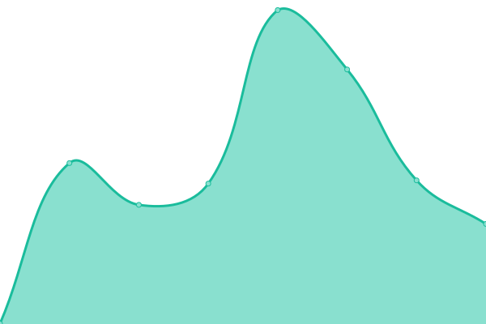
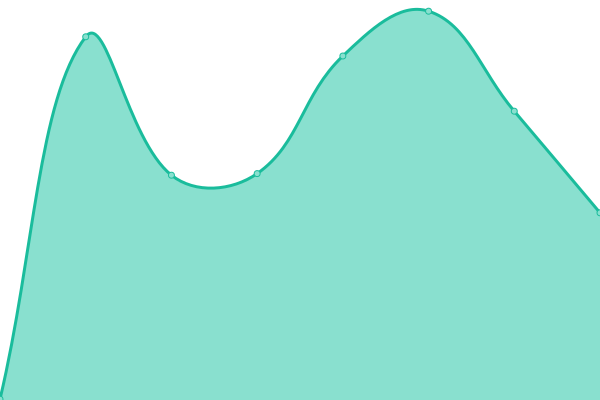

# [📈 Live Status](https://demo.upptime.js.org): <!--live status--> **🟩 All systems operational**

This repository contains the open-source uptime monitor and status page for [NarutoUzumaki24](https://github.com/NarutoUzumaki24), powered by [Upptime](https://github.com/upptime/upptime).

With [Upptime](https://upptime.js.org), you can get your own unlimited and free uptime monitor and status page, powered entirely by a GitHub repository. We use [Issues](https://github.com/NarutoUzumki24/upptime-by-github/issues) as incident reports, [Actions](https://github.com/NarutoUzumaki24/upptime-by-github/actions) as uptime monitors, and [Pages](https://demo.upptime.js.org) for the status page.

<!--start: status pages-->
<!-- This summary is generated by Upptime (https://github.com/upptime/upptime) -->
<!-- Do not edit this manually, your changes will be overwritten -->
<!-- prettier-ignore -->
| URL | Status | History | Response Time | Uptime |
| --- | ------ | ------- | ------------- | ------ |
|  [oak9](https://oak9.io) | 🟩 Up | [oak9.yml](https://github.com/NarutoUzumaki24/upptime-by-github/commits/HEAD/history/oak9.yml) | 

 547ms
     
 | 

<a href="https://NarutoUzumaki24.github.io/upptime-by-github/history/oak9">100.00%</a>
    

|  [oak9 console](https://console.oak9.io) | 🟩 Up | [oak9-console.yml](https://github.com/NarutoUzumaki24/upptime-by-github/commits/HEAD/history/oak9-console.yml) | 

 333ms
     
 | 

<a href="https://NarutoUzumaki24.github.io/upptime-by-github/history/oak9-console">100.00%</a>
    

<!--end: status pages-->

## 📄 License

- Powered by: [Upptime](https://github.com/upptime/upptime)
- Code: [MIT](./LICENSE) © [NarutoUzumki24](https://github.com/NarutoUzumaki24)
